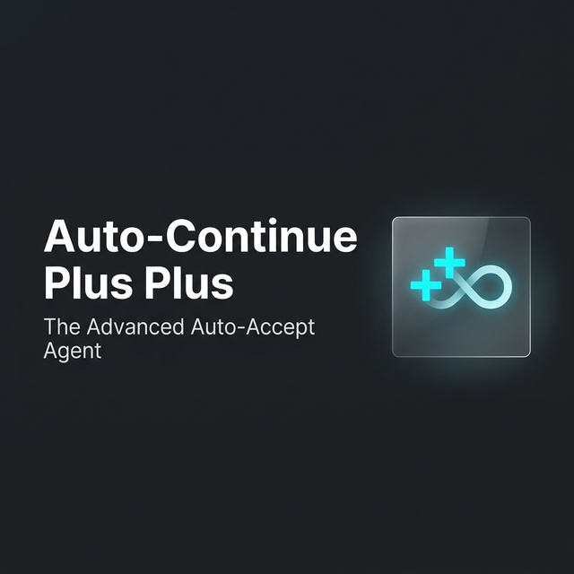

  

<h1 align="center">Auto-Continue Plus Plus</h1>

  <strong>The Advanced Auto-Accept Agent for relentless coding automation.</strong>

 

  <!-- Placeholders for badges once published -->
  
  
  

 

**Auto-Continue Plus Plus** is a premium, high-performance VS Code extension designed to supercharge your AI coding assistants. Say goodbye to constantly hitting "Accept" in the terminal—this agent handles it for you, across multiple tabs, with built-in recovery systems to ensure you never get stuck.

## ✨ Features

- **Relentless Auto-Accept Loop**: Continuously interacts with AI commands so you don't have to manually intervene.
- **True Multi-Tab Tracking**: Automatically monitors and manages different terminals concurrently.
- **Intelligent Watchdog Recovery**: Automatically detects and recovers from stuck or hanging commands.
- **Command Banning**: Protect your environment by preventing the auto-execution of specific, sensitive commands.
- **Lineage Dashboard**: Unprecedented visibility into your agent's execution history. (Coming soon)

## 🚀 Getting Started

> **Note:** Please add a high-quality GIF or WebM here demonstrating the extension auto-accepting commands seamlessly.
> ``

1. **Install** the extension from the VS Code Marketplace.
2. Open the command palette (`Ctrl+Shift+P` or `Cmd+Shift+P`).
3. Run **`Auto-Continue: Toggle Active`** to start the loop.
4. Let your AI agent run free!

## ⚙️ Extension Settings

Customize the agent's behavior directly from your VS Code settings.

| Setting | Type | Default | Description |
|---|---|---|---|
| `autoContinue.pollingSpeed` | `integer` | `2000` | Polling interval (ms) for the auto-accept loop. |
| `autoContinue.watchdogTimeoutSeconds` | `integer` | `60` | Seconds of inactivity before a Stuck Agent recovery. |
| `autoContinue.maxTokenLimit` | `integer` | `120000` | The max token size of your specific LLM Context Window. |
| `autoContinue.bannedCommands` | `array` | `[]` | Keywords or regex patterns that block execution. |

## 🛡️ License

This project is licensed under the MIT License - see the [LICENSE](LICENSE) file for details.

## ☕ Fund the AI Compute Addiction

Creating tools to endlessly feed AI agents requires... well, endless compute! If **Auto-Continue Plus Plus** has saved your fingers from repetitive strain injury or saved you hours of manual clicking, consider fueling my AI addiction:

## 🤝 Support & Feedback

Encountered an issue or have a feature request? Please [open an issue](https://github.com/mbgulden/Auto-Continue-Plus-Plus/issues) on our GitHub repository.
